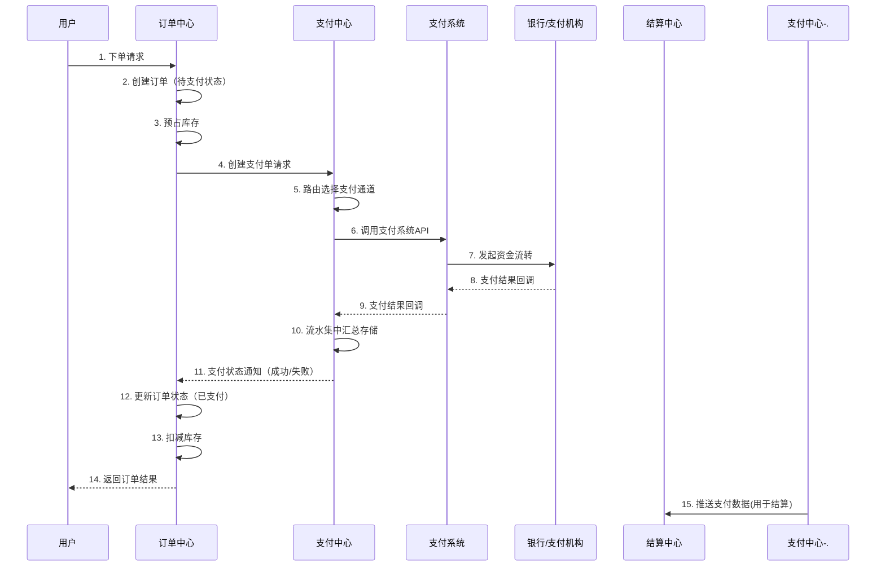
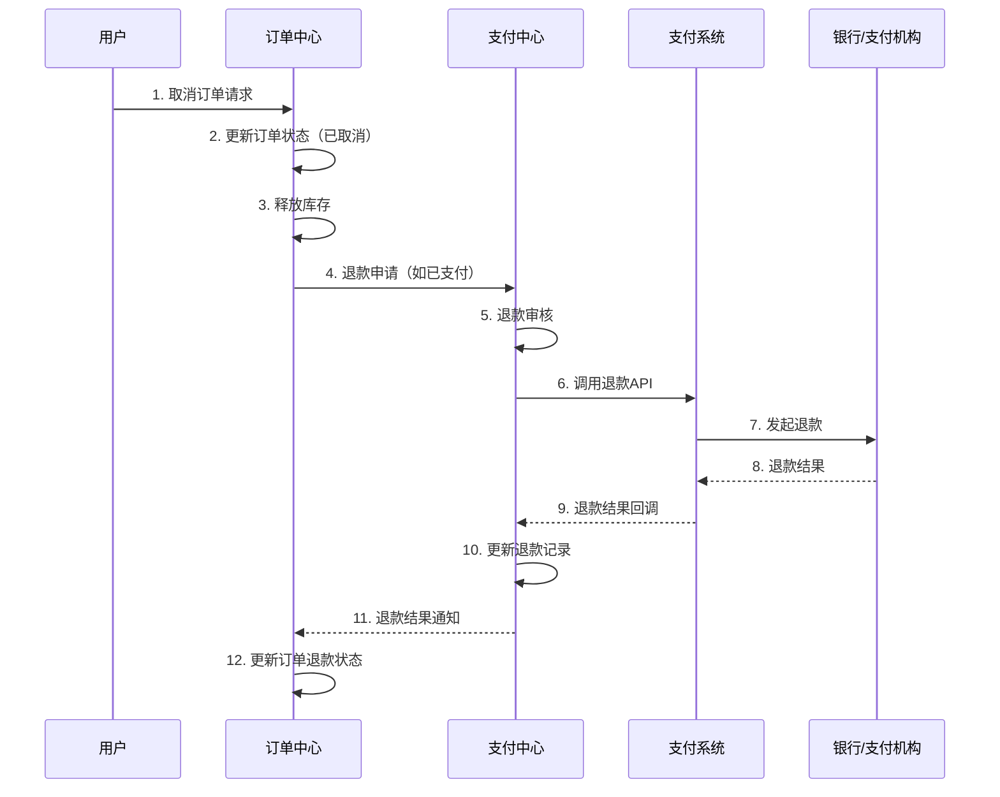
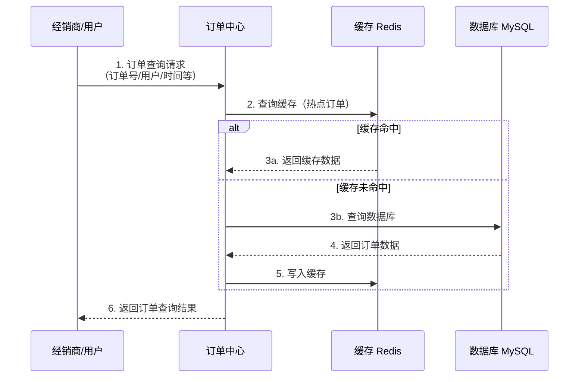
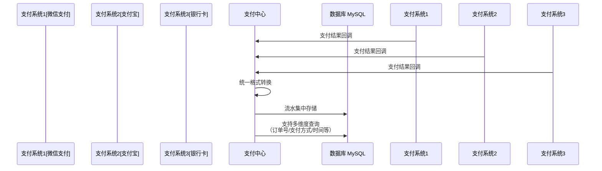
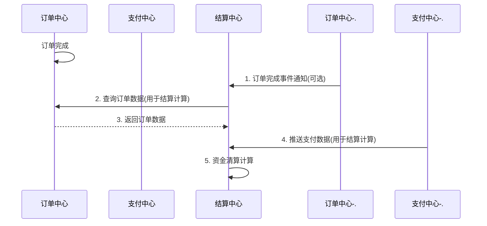
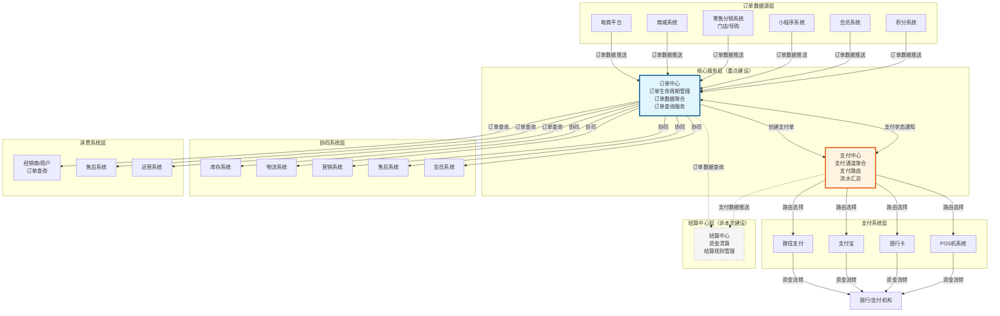
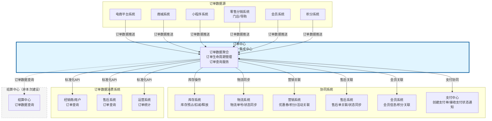
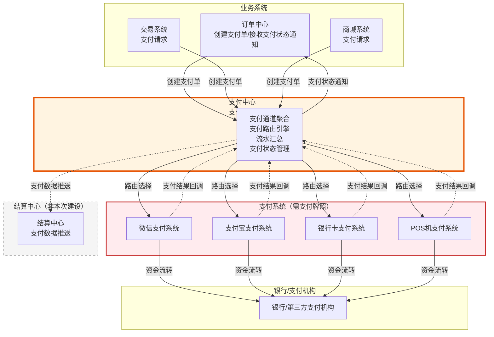
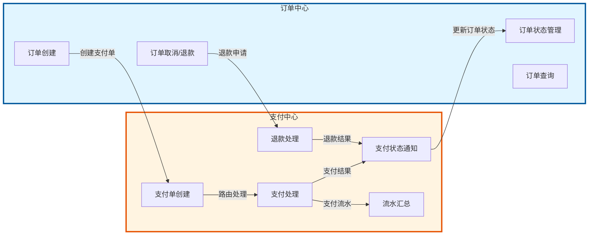
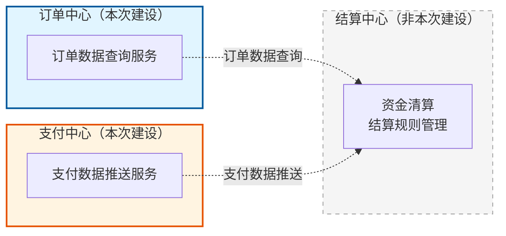

# 无标题文档(1)

# 服务化中心梳理

## 一、中心定位

### 1.1 订单中心定位

**核心定位**： 订单中心是零售核心系统，聚焦订单生命周期管理和数据服务，作为统一订单数据源和标准化服务提供方。

**核心价值**：

*   **统一订单数据源**：聚合全渠道订单数据（线上/线下/积分/定制/预售订单），形成单一数据源，解决订单数据分散问题
    
*   **标准化服务能力**：提供标准化RESTful API，支撑上下游系统调用，降低系统对接成本
    
*   **业务闭环管理**：完整的订单生命周期管理，确保订单从创建到完成的全流程闭环
    
*   **场景覆盖**：支持家居零售各类订单业务场景（定制订单、预售订单、组合订单等）
    

**核心职责**：

*   ✅ 订单生命周期管理：管理订单从创建到完成的全流程状态流转
    
*   ✅ 订单数据聚合：聚合全渠道订单数据，形成统一数据源
    
*   ✅ 订单查询服务：提供多维度订单查询能力，支撑经销商查询电商订单
    
*   ✅ 订单状态流转：管理订单状态变更，与上下游系统协同
    

---

### 1.2 支付中心定位

**核心定位**： 支付中心是企业内部的支付服务中台，聚合多个支付系统的能力，提供统一的支付接入服务。**不需要支付牌照，属于技术服务层。**

**关键特性**：

*   ✅ **不需要支付牌照**：属于技术服务层，不涉及资金托管，不直接处理资金流转
    
*   ✅ **支付通道聚合**：整合多个支付系统的能力（微信、支付宝、银行卡等），提供统一接口
    
*   ✅ **支付路由管理**：根据业务规则（流量、补贴、成本）动态选择最优支付通道
    
*   ✅ **流水集中汇总**：统一管理所有支付系统的支付流水，实现流水集中存储和查询
    

**核心价值**：

*   **统一支付服务**：为业务系统提供统一的支付接入接口，无需直接对接多个支付系统
    
*   **支付路由优化**：根据商业策略（流量入口、补贴政策）动态选择最优支付通道，提升支付成功率
    
*   **流水集中管理**：统一管理全渠道支付流水，便于对账、统计、审计
    
*   **降低对接成本**：业务系统只需对接支付中心，降低多系统对接成本和维护成本
    
*   **灵活扩展**：新增支付通道只需在支付中心配置，业务系统无需改动
    

**核心职责**：

*   ✅ 支付通道聚合：聚合多种支付通道（微信、支付宝、银行卡等），提供统一接入
    
*   ✅ 支付路由管理：根据业务规则选择最优支付通道，支持按流量、补贴、成本等因素动态路由
    
*   ✅ 支付流水集中汇总：统一管理所有支付系统的支付流水，实现流水集中存储和查询
    
*   ✅ 支付状态管理：管理支付状态，向订单中心等系统推送支付状态通知
    
*   ✅ 退款处理：处理退款申请、退款审核、退款执行，并通知相关系统退款结果
    

**与支付系统的关系**：

*   **支付系统（Payment System）**：需要支付牌照，直接处理资金流转（如POS机系统、支付宝、微信支付等），归属交易系统范畴
    
*   **调用关系**：订单中心 → 支付中心 → 支付系统 → 银行/支付机构
    
*   **一对多关系**：一个支付中心可以聚合多个支付系统，多个支付系统可以共用同一个支付中心
    

---

### 1.3 定位对比：支付中心 vs 支付系统

| 维度 | 支付中心（Payment Center） | 支付系统（Payment System） |
| --- | --- | --- |
| **系统定位** | 支付服务中台，支付通道聚合 | 完整的支付处理平台 |
| **资金处理** | 不直接处理资金，通过调用支付系统 | 直接处理资金流转 |
| **支付牌照** | ❌ 不需要支付牌照 | ✅ 需要支付牌照 |
| **与银行关系** | 通过支付系统间接对接 | 直接对接银行/支付机构 |
| **核心能力** | 支付通道聚合、支付路由、统一接口、流水汇总 | 支付受理、授权、清算、结算 |
| **典型代表** | 电商平台支付中台、企业支付中心 | 支付宝、微信支付、POS机系统 |
| **调用关系** | 被业务系统调用，调用支付系统 | 被支付中心调用，直接对接银行/支付机构 |

---

## 二、数据流转

### 2.1 订单创建与支付完整流程



**流程说明**：

1.  **订单创建阶段**：订单中心创建订单，预占库存，通知支付中心创建支付单
    
2.  **支付处理阶段**：支付中心路由选择支付通道，调用支付系统完成支付
    
3.  **支付结果处理**：支付中心汇总流水，通知订单中心支付结果
    
4.  **订单状态更新**：订单中心更新订单状态，扣减库存
    
5.  **结算数据推送**：支付中心推送支付数据到结算中心（用于后续结算计算）
    

---

### 2.2 订单取消与退款流程



**流程说明**：

1.  **订单取消**：订单中心处理订单取消，释放库存
    
2.  **退款申请**：如订单已支付，订单中心通知支付中心处理退款
    
3.  **退款处理**：支付中心调用支付系统退款API，完成退款
    
4.  **退款结果通知**：支付中心通知订单中心退款结果
    

---

### 2.3 订单查询服务流程



**流程说明**：

1.  **查询请求**：经销商/用户发起订单查询请求（支持多维度查询）
    
2.  **缓存查询**：订单中心优先查询缓存，提升查询性能
    
3.  **数据库查询**：缓存未命中时查询数据库，并写入缓存
    
4.  **结果返回**：返回订单查询结果
    

---

### 2.4 支付中心流水汇总流程



**流程说明**：

1.  **支付结果回调**：各支付系统向支付中心推送支付结果
    
2.  **格式转换**：支付中心统一格式转换，标准化支付数据
    
3.  **流水存储**：统一存储到数据库，实现流水集中管理
    
4.  **多维度查询**：支持按订单号、支付方式、时间等维度查询支付流水
    

---

### 2.6 结算数据流转流程（与结算中心协同）



**流程说明**：

1.  **订单完成**：订单中心订单完成，可选推送事件通知
    
2.  **订单数据查询**：结算中心主动从订单中心查询订单数据
    
3.  **支付数据获取**：结算中心从支付中心获取支付数据
    
4.  **结算计算**：结算中心基于订单数据和支付数据进行资金清算计算
    

**说明**：结算中心不在本次建设范围内，但订单中心和支付中心需要提供数据查询和推送能力，支撑结算中心完成结算计算。

---

### 2.7 数据一致性保障

**订单中心与支付中心**：

*   **最终一致性**：支付状态通过消息队列异步通知，保证最终一致
    
*   **补偿机制**：支付中心定期对账，发现不一致时补偿通知
    
*   **幂等性**：订单中心接收支付通知时做幂等处理
    

**与结算中心的数据流转**：

*   **查询模式**：结算中心按需从订单中心查询订单数据，不依赖实时同步
    
*   **推送模式**：支付中心推送支付数据到结算中心，用于结算计算
    
*   **数据快照**：结算时查询订单数据，生成结算快照，不依赖订单数据变更
    

**数据流转原则**：

*   **事件驱动**：基于消息队列实现异步通知，提升系统性能
    
*   **数据隔离**：各中心管理自己的数据，不跨中心存储
    
*   **查询模式**：其他系统需要数据时通过标准化API查询，不依赖实时同步
    

---

## 三、服务能力

### 3.1 订单中心服务能力

#### 3.1.1 订单生命周期管理服务

**核心服务**：

*   **订单创建服务**：接收订单创建请求，生成订单记录，预占库存
    
*   **订单状态流转服务**：管理订单状态变更（待支付→已支付→待发货→已发货→待收货→已完成）
    
*   **订单超时管理服务**：自动处理超时订单（支付超时、发货超时、收货超时、完成超时）
    
*   **订单取消服务**：处理订单取消请求，释放库存，通知支付中心处理退款
    

**订单状态流转**：

```plaintext
待支付 → 已支付 → 待发货 → 已发货 → 待收货 → 已完成
   ↓        ↓        ↓        ↓        ↓
  取消     取消     取消     退货     售后

```

**家居行业特殊状态**：待量尺、待设计、待生产、待安装、待验收

---

#### 3.1.2 订单数据聚合服务

**聚合能力**：

*   **全渠道订单聚合**：聚合线上（电商/商城/小程序）、线下（门店/导购）、积分订单、定制订单、预售订单等全类型订单数据
    
*   **数据标准化**：统一订单数据格式，清洗去重，补全缺失数据
    
*   **实时聚合**：订单创建、状态变更实时同步到订单中心
    
*   **批量聚合**：历史订单数据批量迁移与同步
    

---

#### 3.1.3 订单查询服务

**查询能力**：

*   **多维度查询**：按订单号、用户、场景、时间、商品、门店等多维度查询
    
*   **高性能查询**：支持 100,000+ QPS，响应时间 < 200ms（P99）
    
*   **查询优化**：
    
    *   多级缓存策略（Redis缓存热点订单数据）
        
    *   读写分离（查询走从库，降低主库压力）
        
    *   分库分表（按订单号或用户ID分库分表）
        
    *   ES全文检索（复杂查询场景使用Elasticsearch）
        

**核心应用场景**：

*   **经销商查询电商订单**：提供订单查询服务，支撑经销商查询电商订单
    
*   **用户端"我的订单"**：统一订单入口，全渠道订单统一展示
    
*   **售后端订单查询**：单入口查询订单，提升售后效率
    
*   **运营端订单统计**：统一查询，高性能统计
    

---

#### 3.1.4 订单业务场景服务

**场景支持**：

*   **订单拆分与合并**：
    
    *   订单拆分：按商品类型拆分（现货/定制）、按发货仓库拆分、按配送方式拆分
        
    *   订单合并：同一用户多订单合并发货
        
*   **定制订单流程**：量尺预约→设计方案确认→生产跟踪→安装预约
    
*   **预售订单处理**：定金订单、尾款订单关联管理
    
*   **组合订单管理**：套餐订单、满减订单、赠品订单
    

---

#### 3.1.5 订单状态同步服务

**协同能力**：

*   **与支付中心协同**：接收支付状态通知（支付成功/失败/超时、退款结果通知）
    
*   **与库存系统协同**：库存预占、扣减、释放
    
*   **与物流系统协同**：物流单号同步、物流状态同步
    
*   **与营销系统协同**：优惠券使用记录、积分使用记录、营销活动关联
    
*   **与售后系统协同**：售后单关联、售后状态同步
    

---

#### 3.1.6 订单异常处理与风控服务

**风控能力**：

*   **异常订单识别**：识别重复订单、异常金额订单、异常地址订单、黑名单用户订单
    
*   **风控规则引擎**：可配置的风控规则，支持自动拦截或人工审核
    
*   **订单取消处理**：处理订单取消，释放库存，通知支付中心处理退款
    

---

### 3.2 支付中心服务能力

#### 3.2.1 支付通道聚合服务

**聚合能力**：

*   **多渠道接入**：聚合微信支付、支付宝、银行卡支付、第三方支付等多个支付系统
    
*   **统一接口**：为业务系统提供标准化的支付接入接口
    
*   **通道管理**：支付通道的接入、维护、下线管理
    
*   **通道状态监控**：监控各支付通道的可用性和性能
    

---

#### 3.2.2 支付路由服务

**路由能力**：

*   **动态路由**：根据业务规则选择最优支付通道
    
*   **路由策略**：
    
    *   按流量入口路由（优先使用流量贡献大的支付通道）
        
    *   按补贴政策路由（优先使用补贴比例高的支付通道）
        
    *   按成本路由（优先使用成本低的支付通道）
        
    *   按成功率路由（优先使用成功率高的支付通道）
        
*   **路由配置**：支持配置中心动态调整路由规则，无需重启服务
    
*   **路由优化**：提升支付成功率，降低支付成本
    

---

#### 3.2.3 支付处理服务

**处理能力**：

*   **支付请求处理**：接收支付请求，路由选择支付通道，调用支付系统API
    
*   **支付回调处理**：接收支付系统回调，更新支付状态
    
*   **支付状态管理**：管理支付成功/失败/超时/处理中等状态
    
*   **支付超时处理**：处理支付超时，通知订单中心取消订单
    
*   **支付重试机制**：支付失败后自动重试或人工处理
    

---

#### 3.2.4 退款处理服务

**退款能力**：

*   **退款申请处理**：接收退款申请，进行退款审核
    
*   **退款执行**：调用支付系统退款API，完成退款
    
*   **退款结果通知**：退款完成后通知订单中心等系统
    
*   **退款记录管理**：统一管理退款记录和退款状态
    
*   **退款重试机制**：退款失败后自动重试或人工处理
    

---

#### 3.2.5 流水集中汇总服务

**汇总能力**：

*   **流水统一存储**：统一存储所有支付通道的支付流水
    
*   **格式标准化**：统一各支付系统的流水格式，便于查询和统计
    
*   **多维度查询**：支持按订单号、支付方式、支付时间、支付状态等维度查询
    
*   **流水统计**：
    
    *   支付金额统计（按时间、渠道、订单类型等）
        
    *   支付渠道统计（各渠道支付笔数、金额、成功率）
        
    *   支付成功率统计（整体成功率、各渠道成功率）
        

---

#### 3.2.6 支付状态通知服务

**通知能力**：

*   **支付成功通知**：向订单中心推送支付成功通知，触发订单状态更新
    
*   **支付失败通知**：向订单中心推送支付失败通知
    
*   **支付超时通知**：向订单中心推送支付超时通知，触发订单取消
    
*   **退款结果通知**：向订单中心推送退款结果通知，更新订单退款状态
    
*   **通知机制**：
    
    *   消息队列异步通知（推荐，保证最终一致性）
        
    *   HTTP回调同步通知（可选，实时性要求高的场景）
        

---

## 四、集成关系

### 4.1 整体集成架构图



**整体架构说明**：

*   **订单数据源层**：电商平台、商城、零售分销系统、小程序、会员系统、积分系统等向订单中心推送订单数据
    
*   **核心服务层**：订单中心和支付中心作为本次建设的核心，订单中心与支付中心双向协同
    
*   **协同系统层**：订单中心与库存、物流、营销、售后、会员等系统协同
    
*   **支付系统层**：支付中心聚合多个支付系统，通过路由选择最优支付通道
    
*   **消费系统层**：经销商、用户、售后、运营等系统从订单中心查询订单数据
    
*   **结算中心层**：订单中心和支付中心为结算中心提供数据查询和推送能力（非本次建设，用虚线表示）
    

---

### 4.2 订单中心集成关系



**订单中心集成关系说明**：

*   **订单数据源 → 订单中心**：电商平台、商城、零售分销系统、小程序、会员系统、积分系统等向订单中心推送订单数据（消息队列/HTTP接口）
    
*   **订单中心 → 协同系统**：
    
    *   **库存系统**：下单预占库存，支付成功后扣减库存，取消订单释放库存
        
    *   **物流系统**：物流单号同步，物流状态同步，触发订单状态流转
        
    *   **营销系统**：优惠券使用记录，积分使用记录，营销活动关联
        
    *   **售后系统**：售后单关联，售后状态同步，退货处理
        
    *   **会员系统**：会员信息关联，积分使用记录
        
    *   **支付中心**：创建支付单，接收支付状态通知
        
*   **订单中心 → 消费系统**：为经销商、用户、售后、运营等系统提供标准化RESTful API查询服务
    
*   **订单中心 → 结算中心**：为结算中心提供订单数据查询服务（非本次建设，用虚线表示）
    

**集成收益**：

*   **星型集成**：订单中心作为统一集成中心，降低集成复杂度
    
*   **接口统一**：所有系统对接统一的接口规范
    
*   **一次对接，多端复用**：业务系统只需对接订单中心，无需对接多个上游系统
    

---

### 4.3 支付中心集成关系



**支付中心集成关系说明**：

*   **业务系统 → 支付中心**：订单中心、交易系统、商城系统等业务系统向支付中心创建支付单请求
    
*   **支付中心 → 支付系统**：支付中心根据路由规则选择最优支付系统（微信、支付宝、银行卡、POS机等），调用支付系统API
    
*   **支付系统 → 银行机构**：支付系统直接与银行/支付机构交互，完成资金流转
    
*   **支付系统 → 支付中心**：支付系统回调支付结果给支付中心，支付中心汇总流水
    
*   **支付中心 → 业务系统**：支付中心向订单中心等业务系统推送支付状态通知（成功/失败/超时）
    
*   **支付中心 → 结算中心**：支付中心推送支付数据到结算中心，用于结算计算（非本次建设，用虚线表示）
    

**集成特点**：

*   **一对多关系**：一个支付中心聚合多个支付系统
    
*   **路由机制**：支付中心根据规则选择最优支付系统（按流量、补贴、成本等因素）
    
*   **统一接口**：业务系统只需对接支付中心，无需直接对接多个支付系统
    
*   **灵活扩展**：新增支付通道只需在支付中心配置，业务系统无需改动
    

---

### 4.4 订单中心与支付中心协同关系（核心）



**协同特点**：

*   **双向交互**：订单中心创建支付单，支付中心通知订单状态
    
*   **事件驱动**：通过消息队列实现异步通知，保证最终一致性
    
*   **职责分离**：订单中心负责订单管理，支付中心负责支付处理，职责清晰
    

**交互方式**：

*   **订单中心 → 支付中心**：创建支付单（同步/异步调用）
    
*   **支付中心 → 订单中心**：支付状态通知（消息队列/HTTP回调）
    
*   **订单中心 → 支付中心**：退款申请（如订单取消且已支付）
    
*   **支付中心 → 订单中心**：退款结果通知
    

---

### 4.5 与结算中心的集成关系（非本次建设）



**集成说明**：

*   **订单中心 → 结算中心**：结算中心按需从订单中心查询订单数据（通过标准化API），用于结算计算
    
*   **支付中心 → 结算中心**：支付中心推送支付数据到结算中心（通过消息队列/API），用于结算计算
    
*   **交互方式**：查询模式（订单中心提供查询服务）+ 推送模式（支付中心推送数据）
    
*   **职责边界**：订单中心和支付中心仅提供数据服务，不参与结算计算逻辑
    

**说明**：结算中心不在本次建设范围内，但订单中心和支付中心需要提供相应的数据查询和推送能力，确保与结算中心的协同关系畅通。

---

### 4.8 集成关系总结

**订单中心集成关系**：

*   **数据源系统**：接收订单数据推送（电商、商城、零售分销、小程序等）
    
*   **支付中心**：创建支付单，接收支付状态通知
    
*   **协同系统**：与库存、物流、营销、售后系统协同
    
*   **消费系统**：为经销商、售后、运营系统提供订单查询服务
    
*   **结算中心**：为结算中心提供订单数据查询服务（非本次建设，用虚线表示）
    

**支付中心集成关系**：

*   **业务系统**：接收支付单创建请求（订单中心、交易系统等）
    
*   **支付系统**：调用支付系统API完成支付（微信、支付宝、银行卡等）
    
*   **订单中心**：推送支付状态通知，触发订单状态更新
    
*   **结算中心**：推送支付数据，用于结算计算（非本次建设，用虚线表示）
    

**集成原则**：

*   **职责分离**：各中心职责清晰，不跨职责处理业务
    
*   **事件驱动**：通过消息队列实现异步通知，保证最终一致性
    
*   **数据隔离**：各中心管理自己的数据，不跨中心存储
    
*   **统一接口**：提供标准化API，降低系统对接成本
    
*   **协同支持**：订单中心和支付中心需要支持与结算中心的协同，确保数据流转畅通